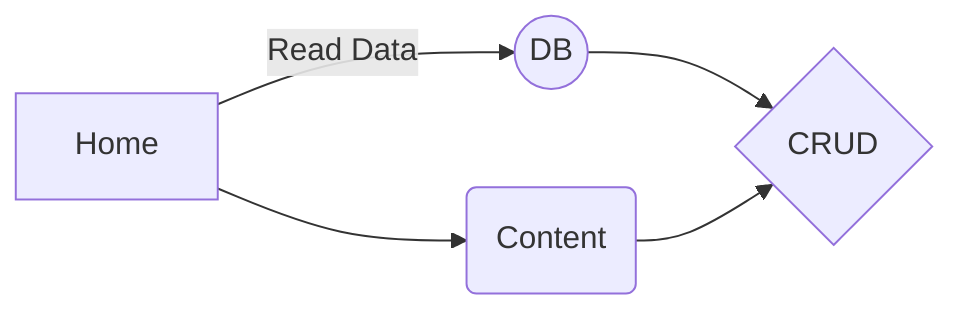

<h1 align="center">Welcome to todomongo 👋</h1>
<p>
  
</p>

```
[app]: Live URL : (https://crudblogger.herokuapp.com/)	"heroku"
```


### All Links Here :link:

| 1. HOME              | https://crudblogger.herokuapp.com/                  |
| -------------------- | --------------------------------------------------- |
| 2. ARTICLES          | https://crudblogger.herokuapp.com/articles          |
| 3. Categories        | https://crudblogger.herokuapp.com/categories        |
| 4.  Manage Articles  | https://crudblogger.herokuapp.com/manage/articles   |
| 5. Manage Categories | https://crudblogger.herokuapp.com/manage/categories |

#### CRUD Functionalities:



> **Note:** The **Crud Blogger** is kind of Medium clone and I will add more features

## Install:saxophone:

```sh
npm install
```

## Usage

```sh
npm run start
```

## Show your support

Give a ⭐️ if you like it!

***
Made with ❤️ by Syed Simanta
